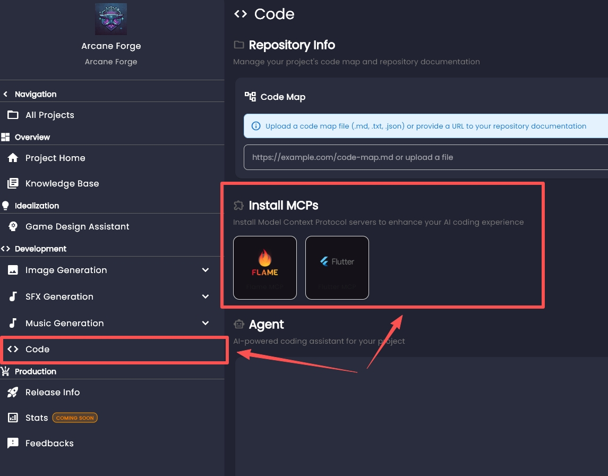
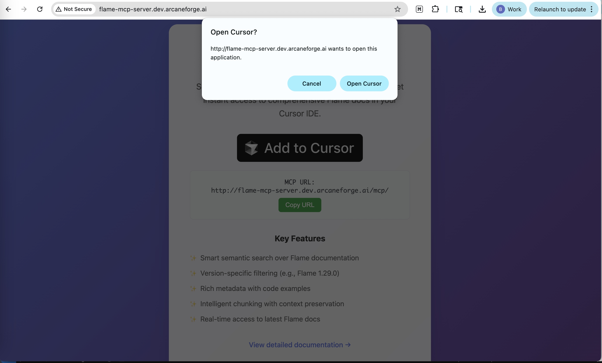
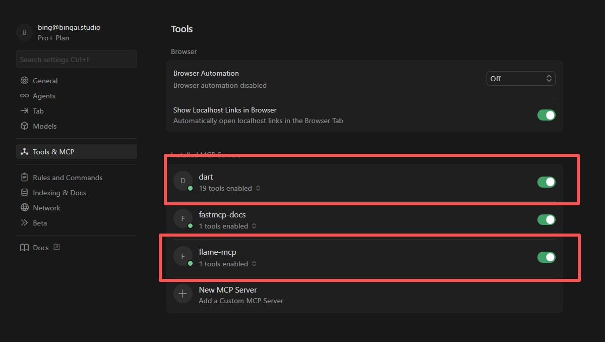

# Flame Engine

## Installation of Flame Engine

Installing Flame engine is pretty simple. You basically just need to install a Flutter dev environment. 

* [Quick Start](https://docs.flutter.dev/get-started/quick)
* [Install Flutter](https://docs.flutter.dev/install)

:::tip
Note that most IDEs(i.e. Cursor) are VSCode based. For any VSCode based IDE, you can still follow the VSCode installation route and install from the extension's marketplace.
:::

Your AI should be able to handle from here with adding Flame to your `pubspec.yaml`. If you prefer a manual install for reasons like specific versioning, you can:

1. run `flutter create your_project_name`
2. run `flutter pub add flame` and `flutter pub get`

You can learn more about Flutter and Flame in [Read More](#read-more) below.

## MCP Server

To ensure the AI understands the Arcane Forge architecture and the Flutter Flame engine, we provide a dedicated Model Context Protocol (MCP) Server.

### Prerequisites

* **AI Code Editor:** We use **Cursor** in most of our demos, but GitHub Copilot or other MCP-compatible editors work as well.
* **Arcane Forge Account:** Access to the dashboard.

### Step 1: Install the Flame and Flutter MCP Server

Before you begin coding, you need to give your IDE "brain access" to the Flame engine documentation.

1.  Open your **Arcane Forge Project Dashboard**.
2.  Go to the `Code` page and locate the `Install MCPs` section.

3.  Click on the `Flame MCP` and `Flutter MCP`.
4.  These buttons will redirect you to the MCP installation web page.
5.  Click **"Add to Cursor"** Button.
6.  When prompted, allow the browser to open your IDE. Your editor will automatically configure the connection.

If you are using other IDE or Cursor's **Add to Cursor** button doesn't work for you, you could always manually configure it, following the specific MCP docs.

* [Flutter MCP](https://docs.flutter.dev/ai/mcp-server#overview)
* [Flame MCP](http://flame-mcp-server.dev.arcaneforge.ai/docs)

### Step 2: Verify the Connection

Once installed, it is good practice to ensure the link is active.

1.  Open your IDE settings (e.g., Cursor Settings).
2.  Navigate to the **MCP** or **Features** tab.
3.  Verify that `flame-mcp-server` is listed and shows a **green "Connected" status**.

### Step 3: Generate Your Game Code

With the MCP server running, your AI agent automatically has context on how to build games with the Flutter Flame engine. You do not need to upload design documents manually.

1.  Open the Chat panel in your IDE.
2.  Enter a prompt to start your project. Be specific about the engine.
    * *Example Prompt:* **"Create a new game project using the Flutter Flame engine. Initialize the basic game loop and a main character."**
3.  The AI will retrieve the correct boilerplate and syntax from the MCP server and begin writing code.

### Step 4: Iteration

As you continue to build, you can simply ask for features like "Add a joystick controller" or "Create a sprite animation." The MCP server ensures the AI uses the correct Flutter Flame components for every request.

## Read More

* [Flame Doc](https://docs.flame-engine.org/latest/)
* [Flutter Doc](https://docs.flutter.dev/)
* Example Games Arcane Forge generated
  * [Shape Rogue](https://github.com/arcane-forge-ai/shape_rogue) -> [Shape Rogue V2](https://github.com/arcane-forge-ai/shape_rogue_v2) -> [Shape Rogue V3](https://github.com/arcane-forge-ai/shape_rogue_v3)