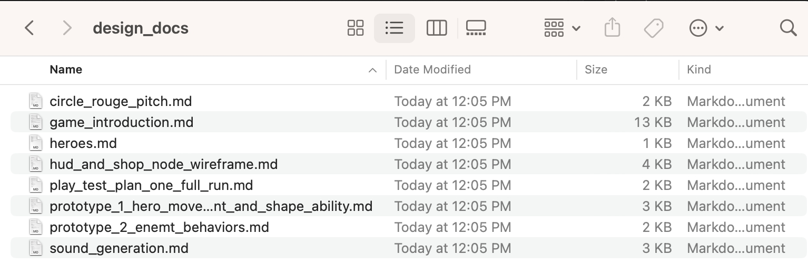
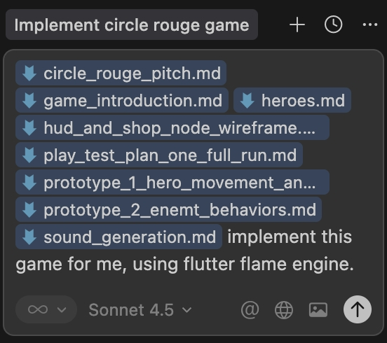
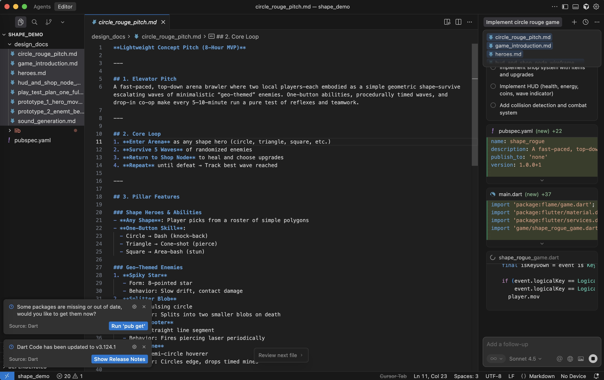

# Quick Starter

While Arcane Forge does not currently provide a native in-cloud coding environment (**this feature is coming soon!**), you can easily generate the code for your game using your favorite AI-powered Integrated Development Environment (IDE).

This guide outlines the workflow for exporting your Arcane Forge design documents and using them to generate a working game prototype.

## Prerequisites

You will need an AI-assisted code editor installed on your local machine. Any of the following are excellent choices:
* **Cursor** (Used in this guide)
* GitHub Copilot
* Google Cloud Code

## Step 1: Export Your Design Documents

To build your game, the AI needs to understand the mechanics, story, and logic you have created.
1.  Go to your **Knowledge Base** in Arcane Forge.
2.  Download or copy all relevant design documents for your project.
3.  **Recommended:** Organize these files into a specific folder within your project directory (e.g., a folder named `design_docs`). This keeps your context clean and easy to manage.

## Step 2: Load Context into your IDE

Open your chosen IDE (e.g., Cursor). You need to provide the AI with the context of your game design.

1.  Open the AI Chat interface within the IDE.
2.  Select all your design documents from the folder you created in Step 1.
3.  Drag and drop them directly into the chat window. Alternatively, use the IDE's "Add Context" feature to reference these files.

## Step 3: Generate the Code

Once the context is loaded, you can instruct the AI to build your game.

### The Prompt
For the best results, be specific about the technology stack. Internally, Arcane Forge utilizes the **Flutter Flame** engine for all our frontend projects, including all games we built. But you can choose whatever engine you want.

Type the following prompt into the chat:

> "Implement this game for me using the Flutter Flame engine."

### Execution Modes
Depending on your IDE, you may have different ways to execute this command:
* **Plan Mode:** If available, use this to review the AI's proposed file structure and implementation steps before it begins writing code. This provides a more controlled generation process.
* **Run/Generate:** If you prefer a hands-off approach (i.e. you are not a coding person), simply hit "Run." The AI will begin generating the necessary code files immediately.

## Step 4: Iteration

It may take a few moments for the AI to write the full codebase. Once complete, you can run the project locally to test your game. If you need to make changes, simply continue the chat session, referencing the specific files you wish to modify.

# Read More
