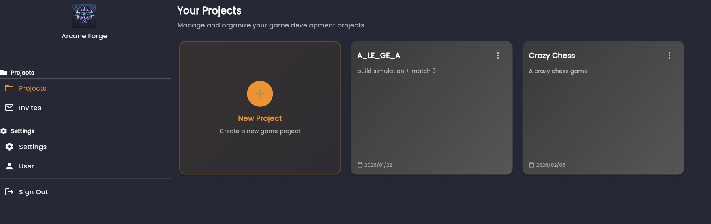
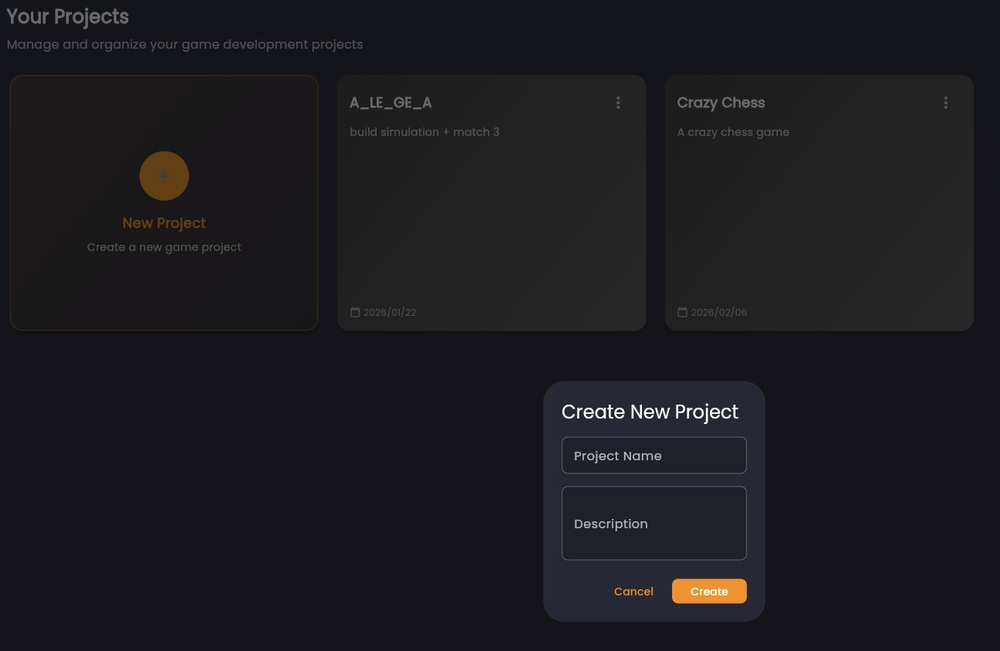

# Projects and Collaboration

A project is the core unit of work in Arcane Forge. It keeps design, implementation, assets, and iteration connected for one game.

## What a Project Is

Use this mental model:
- One project = one game, or one serious experiment
- Projects are long-lived and iterative
- AI tools operate within project context, not isolated chats

## Why Project-Scoped Context Matters

Project boundaries reduce context drift. With project-scoped workflows:
- AI can reference prior decisions
- Generated outputs remain connected to intent
- Teams reuse knowledge instead of rewriting prompts

## Creating a Project

Create a new project from the Projects dashboard with:
- Project name
- Project description

"

"

## Ownership and Permissions

Each project has one owner. By default:
- Owner invites collaborators
- Owner manages membership and permissions

Keep ownership explicit so accountability is clear.

## Invite Flow

From the project menu:
1. Open Team Members
2. Invite collaborators by email
3. Collaborator accepts from the Invites page

`[AF_SCREENSHOT_SPEC id="team-members-panel" file="./images/team-members-panel.png" alt="Team members panel" capture="Team members panel with current members and invite action" replace_with=""]`

`[AF_SCREENSHOT_SPEC id="invite-member-flow" file="./images/invite-member-flow.png" alt="Invite member flow" capture="Invite dialog or workflow showing email entry and send action" replace_with=""]`

`[AF_SCREENSHOT_SPEC id="pending-invitations" file="./images/pending-invitations.png" alt="Pending invitations page" capture="Invites section showing pending invitations with accept and decline actions" replace_with=""]`

## Collaboration Hygiene

Recommended operating practices:
- Keep one clear game objective per project
- Save major design decisions to the Knowledge Base
- Use short, scoped design conversations for better AI precision
- Treat project context as the source of truth

Next: [Project Home and Context](/docs/idealization/project-home-and-context)
