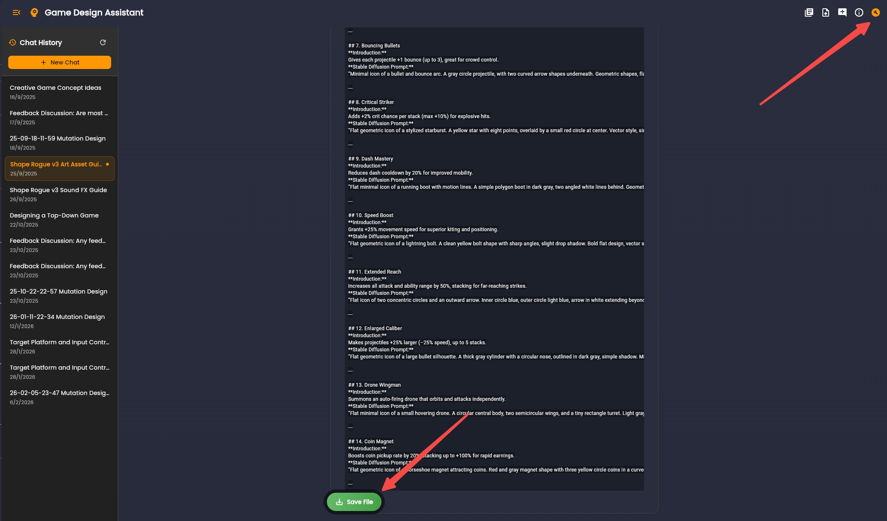

# Design Assistant and Evaluation

Use the Design Assistant to define game behavior and close design gaps before implementation.

## Scoped Design Conversations

Keep each thread focused on one decision area, such as:
- Core mechanics
- Economy and progression
- Input model and platform constraints

Scoped threads reduce context drift and improve output quality.

## Save Stable Outputs to the Knowledge Base

When a conversation produces a stable design artifact, save it immediately.

This converts short-term chat context into durable project memory.

(In case the `Save File` button doesn't pop out, you can toggle it using the tooltip button on upper right.)

## Design Evaluation

Run evaluation to detect implementation blockers and ambiguous decisions.

Typical outputs include:
- Severity-tagged knowledge gaps
- Readiness assessment for production
- Market and competitor context

## Improve With AI

For each identified gap, use Improve with AI to open a focused follow-up thread, resolve the issue, and save the updated output back to the Knowledge Base.

Next: [Coding Quick Starter](/docs/coding/intro)
