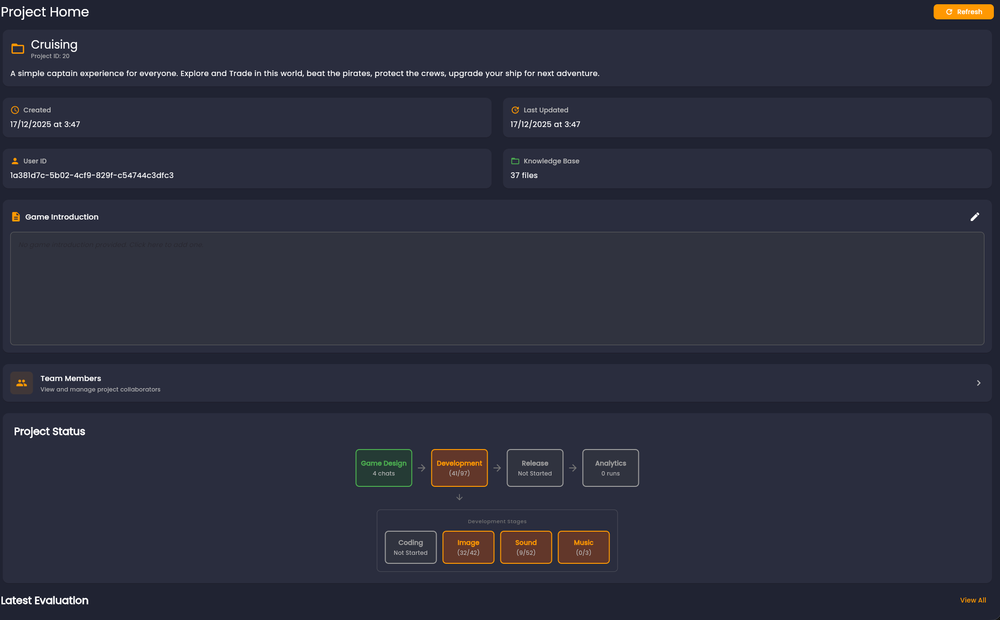

# Project Home and Context

Project Home is the control center for project identity and status.

## Project ID and Metadata

Project Home exposes key metadata, including a stable Project ID used for support and collaboration.

Use Project ID when reporting issues or discussing project state with your team.

## Game Introduction as Intent Anchor

Game Introduction should answer:
- What game are we building?
- Who is it for?
- What are the non-negotiable design goals?

Keep it short but specific. Update it whenever direction changes.

## Progress Indicators and Release State

Project progress tracks high-level production coverage across design, coding, and asset stages.

When released, attach a game URL so iteration and feedback stay linked to the same project.

Next: [Knowledge Base](/docs/idealization/knowledge-base)
