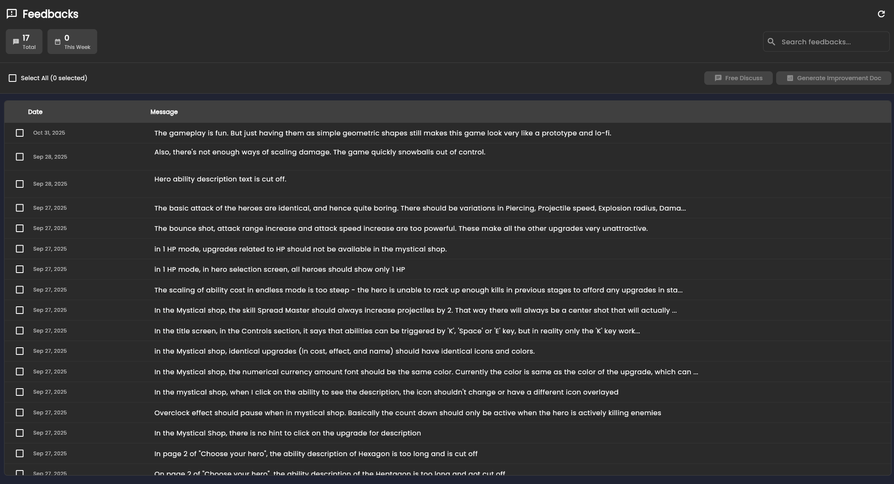
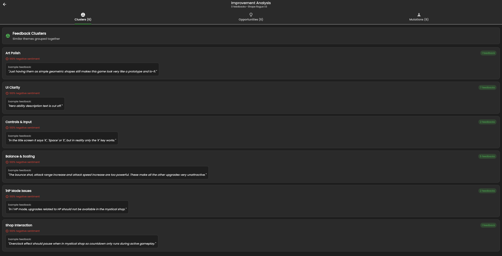
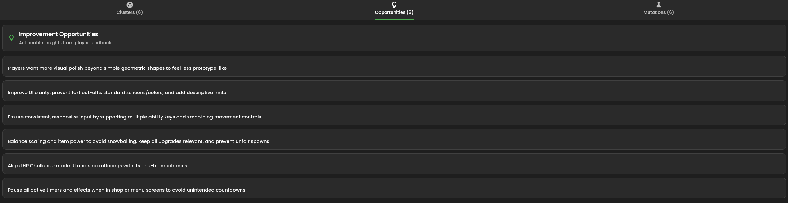
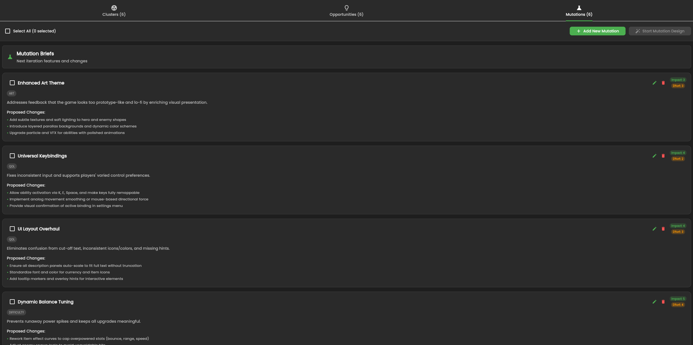

# Feedback and Mutation Design

This page covers the operational workflow from raw player comments to delta design updates.

## Step 1: Connect a Feedback Source

Attach a feedback endpoint or API link in project release data so Arcane Forge can retrieve player comments.

## Step 2: Review Player Comments

Use the comments list to inspect raw player voice before analysis.

## Step 3: Choose Analysis Mode

Assisted discussion:
- Select comments
- Send to Design Assistant
- Ask targeted product questions

Automated analysis:
- Run full clustering and synthesis
- Produce opportunities and candidate mutations

## Step 4: Review Clusters and Opportunities

Automated analysis should produce:
- Feedback clusters by problem area
- Actionable opportunities
- Proposed mutations with impact and effort

## Step 5: Generate Delta GDD

Select the mutations you want, then open a mutation design session to generate delta GDD updates. Review and save accepted changes into the Knowledge Base.

## Loop Closure

Use the updated design to drive the next implementation cycle:

`Feedback -> Analysis -> Design Change -> Build -> Release`

Next: [Build Your First Game](/docs/get-started/build-your-first-game)
