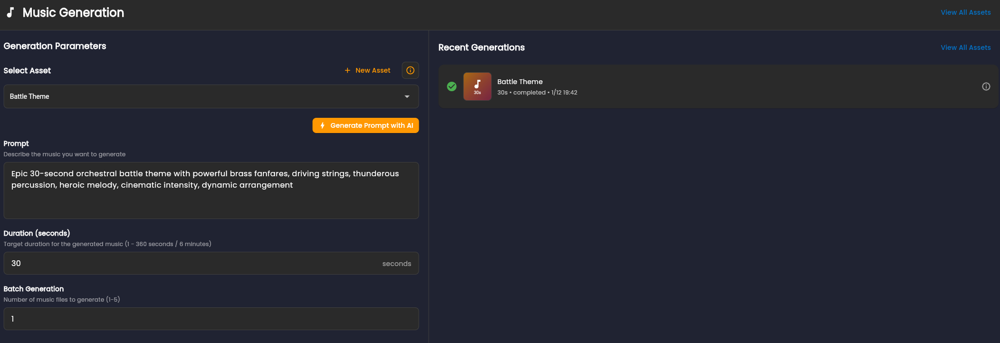

# Music Generation

Music generation follows the same asset lifecycle as SFX: one track intent, multiple generations, and review-based selection.

## Asset Lifecycle

Define the track goal first, such as:
- Main menu theme
- Combat loop
- Victory stinger

Then iterate versions inside the same asset.

## Prompting Guidance

Include musical direction in prompts:
- Mood and energy
- Tempo or pacing
- Instrument style
- Loop behavior if needed

## Generation Controls and Review

Use prompt controls and generation count to explore options, then compare outputs in Recent Generations before selecting favorites.

## Current State

Music generation is beta. Results improve with clear prompt constraints and iterative passes.

Next: [Iteration](/docs/iteration/intro)
