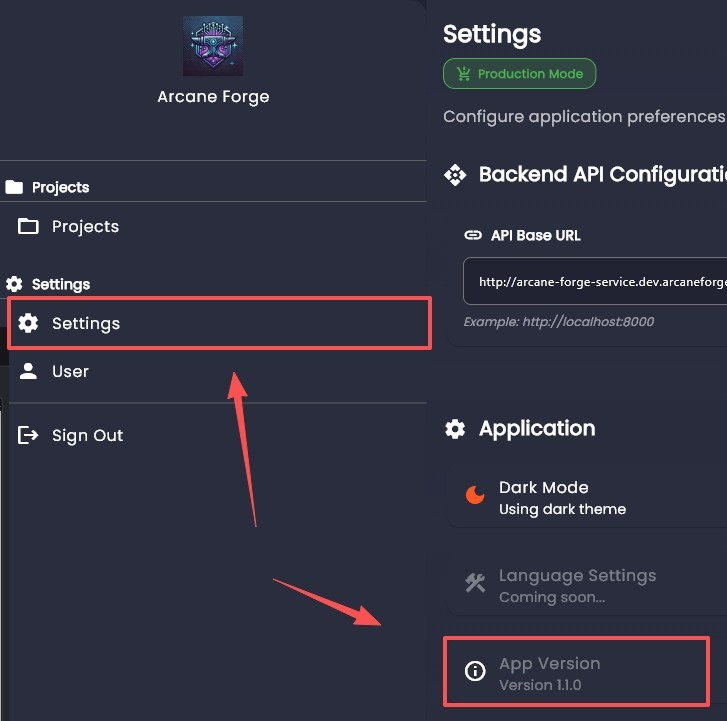

# FAQs

Frequently asked questions about Arcane Forge.

## Debug Related

### How can I report a bug

You can create a Github Issue at [arcane-forge-ai/arcane-forge-studio](https://github.com/arcane-forge-ai/arcane-forge-studio/issues). When creating your version, make sure you attach with your version and have tried [upgrading](../get-started/installation.md#upgrade) to the [newest software version](https://github.com/arcane-forge-ai/arcane-forge-studio/releases). 

### Where can I find my version

You can find your version in `Settings` > `Application` > `App Version`.

